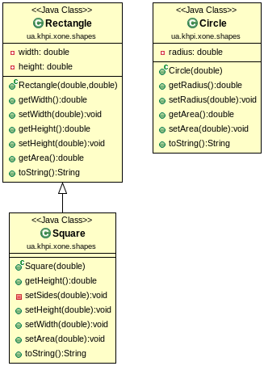

[<< Previous task](task06.md) | [Practice tasks](readme.md#practice) | [Next task >>](task08.md)

<span id="task_07"></span>
## 7. Object-Oriented Programming: Method Overriding, Polymorphism.

- [The Java Tutorials - Overriding and Hiding Methods](https://docs.oracle.com/javase/tutorial/java/IandI/override.html).
- [The Java Tutorials - Polymorphism](https://docs.oracle.com/javase/tutorial/java/IandI/polymorphism.html).
- [w3schools - Java Polymorphism](https://www.w3schools.com/java/java_polymorphism.asp).

> **Note:** The dictionary definition of polymorphism refers to a principle in biology in which an organism or species can have many different forms or stages. This principle can also be applied to object-oriented programming and languages like the Java language. Subclasses of a class can define their own unique behaviors and yet share some of the same functionality of the parent class.

1) Create and test the following classe: `Circle`, `Rectangle`, `Square`. Implement the necessary methods: `getXxx`, `setXxx`, `toString`.

Class diagram of created classes:



2) Create `ShapeUtils` class, implement the `ShapeUtils.printShapes` method, as shown below.

```java
public static void printShapes(Object[] shapes) {
	for (Object s : shapes) {
		System.out.println(s);
	}
}
```

3) Use the following `Main` class to test implemented functionality:

```java
public class Main {
	public static void main(String[] args) {
		Object[] shapes = { new Circle(10), new Rectangle(20, 30), new Square(40) };
		ShapeUtils.printShapes(shapes);
	}
}
```

You should obtain the following result:

```
Circle: radius = 10.0
Rectangle: width = 20.0, height = 30.0
Square: width = 40.0
```

> **Note:** We have: Circle, Rectangle, and Square classes.
>
> **Note:** We want to be able to:
>
> - Call `getArea` on an instance of any of three, even if we do not know which of the three types it is.
> - Make an array of mixed shapes and calculate the sum of the areas.
> - Make this array-summing method flexible enough to handle future types of shapes (Triangle, Ellipse, etc.).

4) Implement the `ShapeUtils.sumAreas` method, as shown below.

```java
	public static double sumAreas(Object[] shapes) {
		double sum = 0;
		for (Object s : shapes) {
			// sum = sum + s.getArea(); // Illegal! Object does not have getArea
		}
		return (sum);
	}
```

5) Try to make this method workable. It should return the sum of the areas of the shapes. Modify Main class to test the `ShapeUtils.sumAreas` method:

```java
Double sum = ShapeUtils.sumAreas(shapes);
System.out.format("%.2f", sum);
```

If you are using previously created shapes, you should obtain the following result:

```
2514.16
```

<br>

[<< Previous task](task06.md) | [Practice tasks](readme.md#practice) | [Next task >>](task08.md)

